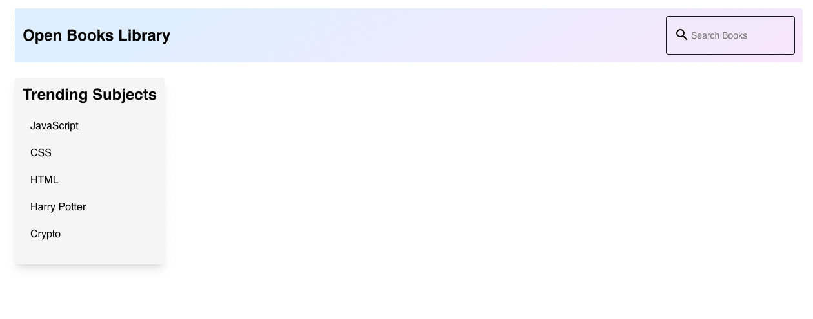
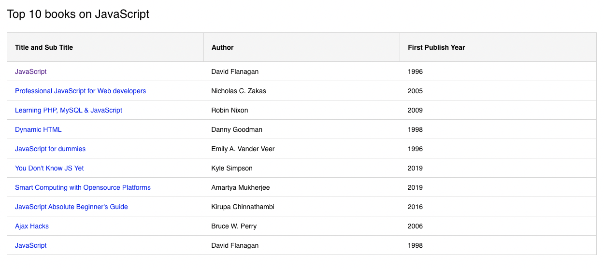
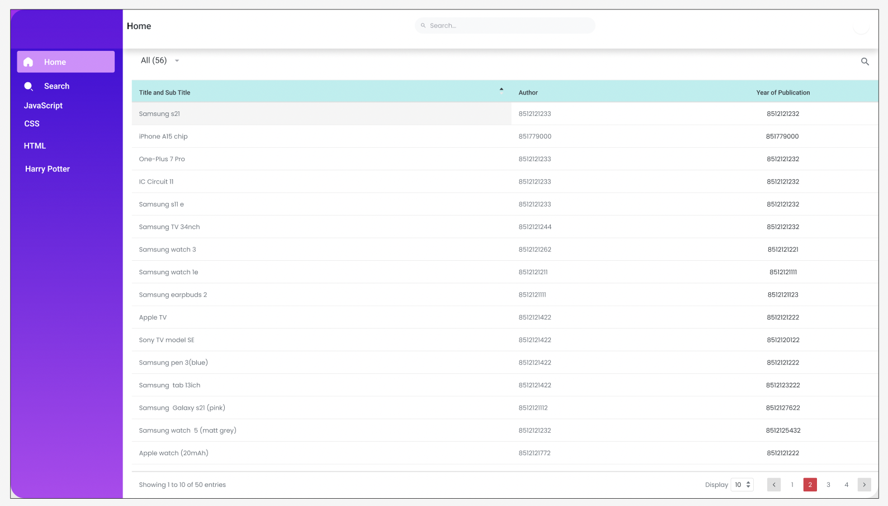

## Application
- The app is a Books library using the Open Library Subjects and Search APIs
- `Subjects API` doc - [https://openlibrary.org/dev/docs/api/subjects](https://openlibrary.org/dev/docs/api/subjects)
- `Search API` doc - [https://openlibrary.org/dev/docs/api/search](https://openlibrary.org/dev/docs/api/search)

## Challenge
### Your tasks
*You can fork this repo and follow instructions on the README.md to view this*
- Add [Missing Features](#missing-features)
- Deploy using Netlify, vercel or Heroku or any other platform and the deployment link (a live version of the application) should be shared.

Once you are done with your task, please use this form [https://forms.gle/wBLwzmz1Gs5CsRFp7](https://forms.gle/wBLwzmz1Gs5CsRFp7) to complete your submission.
You will hear back within 48 hours from us via email.

---
## Available Features

### Home Page

### Trending Subjects
- clicking on each of this will navigate to a new URL.
- that will load the data using the `Subjects API` referenced above.

## Missing Features
*You will need to implement this*

__Note__ - This challenge is in angular. We work on angular frameworks & after you join we expect the same from you. Hence it is required to complete this assignement in angular itself.

### Search box
- __Implement Search by book title or author name__ - Make the search box to allows us to search books by booktitle or author name - can use the `Search API` referenced above for this. The results must be shown in the same home page and using the table view component.
- __Paginated results__ - The results must be `paginated` - not more than 10 search results must be retrieved in one go (use `offset` and `limit`). There must be a way to view the `Next` set of search results and similarly also be able to view the `Previous` page results.
- __Clear search text__ - The search key must be visible in the search box and there must be a way to clear the searched text.

*You can use the below wireframe for your reference.*

### Fix Bugs
- Handle `all edge cases` related to `api` calls including no results found.
- Add Loaders on the page while fetching data for both the Trending Subjects redirected table view and the new Search result view.
- Add a Back button to `Go back to the home page` from the Trending Subject page.

### Other Features
- Implement caching for the API responses.